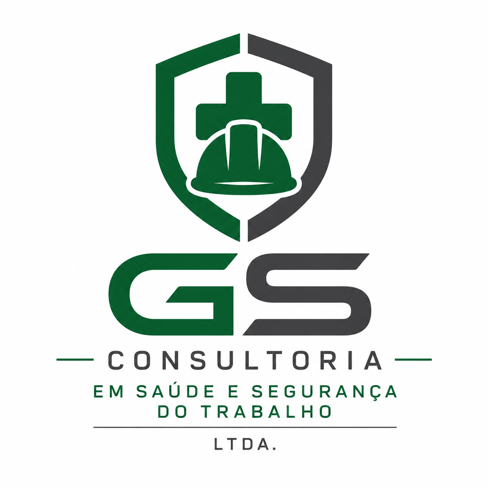

```html
<!DOCTYPE html>
<html lang="pt-BR">
<head>
    <meta charset="UTF-8">
    <meta name="viewport" content="width=device-width, initial-scale=1.0">

    <title>GS Consultoria | Saúde e Segurança do Trabalho</title>

    <meta name="description" content="GS Consultoria em Saúde e Segurança do Trabalho LTDA. Consultoria, assessoria, treinamentos, PGR, GRO, LTCAT, laudos e soluções em SST no Rio de Janeiro.">

    <meta name="keywords" content="segurança do trabalho, SST, PGR, GRO, LTCAT, laudos, treinamentos NR, consultoria SST, Rio de Janeiro">

    <meta name="author" content="GS Consultoria em Saúde e Segurança do Trabalho LTDA">

    <style>
        * {
            margin: 0;
            padding: 0;
            box-sizing: border-box;
        }

        html {
            scroll-behavior: smooth;
        }

        body {
            font-family: Arial, Helvetica, sans-serif;
            color: #1b263b;
            background: #ffffff;
            line-height: 1.6;
        }

        a {
            text-decoration: none;
        }

        .container {
            width: 90%;
            max-width: 1200px;
            margin: auto;
        }

        /* HEADER */

        header {
            background: #ffffff;
            position: sticky;
            top: 0;
            z-index: 1000;
            box-shadow: 0 2px 12px rgba(0,0,0,0.08);
        }

        .header-content {
            min-height: 82px;
            display: flex;
            align-items: center;
            justify-content: space-between;
            gap: 30px;
        }

        .logo-area {
            display: flex;
            align-items: center;
            gap: 12px;
        }

        .logo-area img {
            width: 65px;
            height: 65px;
            object-fit: contain;
        }

        .logo-text {
            font-weight: 800;
            color: #0b3954;
            font-size: 21px;
            line-height: 1.1;
        }

        .logo-text span {
            display: block;
            font-size: 11px;
            color: #537895;
            margin-top: 4px;
            letter-spacing: .5px;
        }

        nav {
            display: flex;
            align-items: center;
            gap: 24px;
        }

        nav a {
            color: #263238;
            font-weight: 600;
            font-size: 14px;
            transition: .3s;
        }

        nav a:hover {
            color: #0b6e99;
        }

        .nav-button {
            background: #0b6e99;
            color: white !important;
            padding: 11px 18px;
            border-radius: 7px;
        }

        .nav-button:hover {
            background: #084f70;
        }

        /* HERO */

        .hero {
            background:
                linear-gradient(rgba(7, 34, 52, .88), rgba(7, 34, 52, .88)),
                url("img/hero.jpg") center/cover no-repeat;
            color: white;
            min-height: 590px;
            display: flex;
            align-items: center;
        }

        .hero-content {
            max-width: 780px;
            padding: 80px 0;
        }

        .hero h1 {
            font-size: clamp(36px, 5vw, 62px);
            line-height: 1.08;
            margin-bottom: 25px;
            font-weight: 800;
        }

        .hero h1 span {
            color: #55c2e8;
        }

        .hero p {
            font-size: 20px;
            max-width: 680px;
            margin-bottom: 35px;
            color: #e8f2f7;
        }

        .hero-buttons {
            display: flex;
            flex-wrap: wrap;
            gap: 15px;
        }

        .btn {
            display: inline-block;
            padding: 15px 25px;
            border-radius: 7px;
            font-weight: 700;
            transition: .3s;
        }

        .btn-primary {
            background: #0b9bd7;
            color: white;
        }

        .btn-primary:hover {
            background: #087eb0;
            transform: translateY(-2px);
        }

        .btn-secondary {
            border: 2px solid white;
            color: white;
        }

        .btn-secondary:hover {
            background: white;
            color: #0b3954;
        }

        /* DESTAQUES */

        .highlights {
            margin-top: -55px;
            position: relative;
            z-index: 10;
        }

        .highlight-grid {
            display: grid;
            grid-template-columns: repeat(3, 1fr);
            gap: 20px;
        }

        .highlight {
            background: white;
            padding: 30px;
            border-radius: 10px;
            box-shadow: 0 8px 30px rgba(0,0,0,.10);
        }

        .highlight-icon {
            font-size: 30px;
            margin-bottom: 12px;
        }

        .highlight h3 {
            color: #0b3954;
            margin-bottom: 8px;
        }

        .highlight p {
            color: #667781;
            font-size: 14px;
        }

        /* SECTIONS */

        section {
            padding: 90px 0;
        }

        .section-title {
            text-align: center;
            margin-bottom: 55px;
        }

        .section-title h2 {
            font-size: 38px;
            color: #0b3954;
            margin-bottom: 12px;
        }

        .section-title p {
            color: #667781;
            max-width: 700px;
            margin: auto;
        }

        /* SOBRE */

        .about {
            background: #f5f8fa;
        }

        .about-grid {
            display: grid;
            grid-template-columns: 1fr 1fr;
            gap: 60px;
            align-items: center;
        }

        .about-image {
            min-height: 390px;
            background:
                linear-gradient(rgba(11,57,84,.15), rgba(11,57,84,.15)),
                url("img/empresa.jpg") center/cover no-repeat;
            border-radius: 12px;
            box-shadow: 0 12px 35px rgba(0,0,0,.12);
        }

        .about-text h2 {
            color: #0b3954;
            font-size: 36px;
            margin-bottom: 20px;
        }

        .about-text p {
            color: #53656e;
            margin-bottom: 18px;
        }

        .about-list {
            list-style: none;
            margin-top: 25px;
        }

        .about-list li {
            margin-bottom: 12px;
            font-weight: 600;
            color: #344e5c;
        }

        .about-list li::before {
            content: "✓";
            color: #0b8cc2;
            font-weight: bold;
            margin-right: 10px;
        }

        /* SERVIÇOS */

        .services-grid {
            display: grid;
            grid-template-columns: repeat(3, 1fr);
            gap: 25px;
        }

        .service-card {
            padding: 30px;
            border: 1px solid #e1e8ec;
            border-radius: 10px;
            background: white;
            transition: .3s;
        }

        .service-card:hover {
            transform: translateY(-5px);
            box-shadow: 0 12px 30px rgba(0,0,0,.09);
            border-color: #b8dcea;
        }

        .service-icon {
            font-size: 32px;
            margin-bottom: 18px;
        }

        .service-card h3 {
            color: #0b3954;
            margin-bottom: 12px;
        }

        .service-card p {
            color: #667781;
            font-size: 14px;
        }

        /* DIFERENCIAIS */

        .differentials {
            background: #0b3954;
            color: white;
        }

        .differentials .section-title h2 {
            color: white;
        }

        .differentials .section-title p {
            color: #d4e4eb;
        }

        .differential-grid {
            display: grid;
            grid-template-columns: repeat(4, 1fr);
            gap: 25px;
        }

        .differential {
            text-align: center;
            padding: 25px 15px;
        }

        .differential strong {
            display: block;
            font-size: 20px;
            margin-bottom: 8px;
        }

        .differential p {
            color: #c8dbe4;
            font-size: 14px;
        }

        /* CTA */

        .cta {
            background:
                linear-gradient(rgba(8,52,75,.93), rgba(8,52,75,.93)),
                url("img/cta.jpg") center/cover no-repeat;
            color: white;
            text-align: center;
        }

        .cta h2 {
            font-size: 40px;
            margin-bottom: 15px;
        }

        .cta p {
            max-width: 700px;
            margin: 0 auto 30px;
            color: #d9e8ee;
        }

        /* CONTATO */

        .contact {
            background: #f5f8fa;
        }

        .contact-grid {
            display: grid;
            grid-template-columns: 1fr 1fr;
            gap: 40px;
        }

        .contact-info {
            background: white;
            padding: 35px;
            border-radius: 10px;
            box-shadow: 0 5px 20px rgba(0,0,0,.06);
        }

        .contact-info h3 {
            color: #0b3954;
            margin-bottom: 25px;
            font-size: 25px;
        }

        .contact-item {
            margin-bottom: 20px;
        }

        .contact-item strong {
            display: block;
            color: #0b3954;
            margin-bottom: 4px;
        }

        .contact-item span {
            color: #657780;
        }

        .contact-box {
            background: #0b3954;
            color: white;
            border-radius: 10px;
            padding: 40px;
            display: flex;
            flex-direction: column;
            justify-content: center;
        }

        .contact-box h3 {
            font-size: 30px;
            margin-bottom: 15px;
        }

        .contact-box p {
            color: #d5e5ec;
            margin-bottom: 25px;
        }

        /* FOOTER */

        footer {
            background: #071f2e;
            color: #b9cbd4;
            padding: 35px 0;
        }

        .footer-content {
            display: flex;
            justify-content: space-between;
            gap: 30px;
            align-items: center;
        }

        .footer-brand {
            color: white;
            font-weight: 700;
        }

        .footer-copy {
            font-size: 13px;
            text-align: right;
        }

        /* WHATSAPP */

        .whatsapp {
            position: fixed;
            right: 22px;
            bottom: 22px;
            width: 60px;
            height: 60px;
            border-radius: 50%;
            background: #25d366;
            color: white;
            display: flex;
            justify-content: center;
            align-items: center;
            font-size: 29px;
            z-index: 2000;
            box-shadow: 0 5px 18px rgba(0,0,0,.25);
            transition: .3s;
        }

        .whatsapp:hover {
            transform: scale(1.08);
        }

        /* MOBILE */

        @media (max-width: 900px) {

            nav {
                display: none;
            }

            .highlight-grid,
            .services-grid {
                grid-template-columns: 1fr 1fr;
            }

            .differential-grid {
                grid-template-columns: 1fr 1fr;
            }

            .about-grid,
            .contact-grid {
                grid-template-columns: 1fr;
            }

            .about-image {
                min-height: 300px;
            }
        }

        @media (max-width: 600px) {

            .header-content {
                min-height: 72px;
            }

            .logo-area img {
                width: 52px;
                height: 52px;
            }

            .logo-text {
                font-size: 17px;
            }

            .logo-text span {
                font-size: 9px;
            }

            .hero {
                min-height: 540px;
            }

            .hero p {
                font-size: 17px;
            }

            .hero-buttons {
                flex-direction: column;
                align-items: stretch;
            }

            .btn {
                text-align: center;
            }

            .highlights {
                margin-top: 0;
                padding-top: 25px;
            }

            .highlight-grid,
            .services-grid,
            .differential-grid {
                grid-template-columns: 1fr;
            }

            section {
                padding: 65px 0;
            }

            .section-title h2 {
                font-size: 30px;
            }

            .about-text h2 {
                font-size: 30px;
            }

            .cta h2 {
                font-size: 30px;
            }

            .footer-content {
                flex-direction: column;
                text-align: center;
            }

            .footer-copy {
                text-align: center;
            }
        }
    </style>
</head>

<body>

<header>
    <div class="container header-content">

        <a href="#inicio" class="logo-area">

            <!--
            Para colocar sua logo:
            crie a pasta "img" no GitHub
            e envie sua logo com o nome:
            logo.png
            -->

            

            <div class="logo-text">
                GS CONSULTORIA
                <span>SAÚDE E SEGURANÇA DO TRABALHO</span>
            </div>

        </a>

        <nav>
            <a href="#inicio">Início</a>
            <a href="#empresa">Empresa</a>
            <a href="#servicos">Serviços</a>
            <a href="#diferenciais">Diferenciais</a>
            <a href="#contato">Contato</a>
            <a class="nav-button" href="https://wa.me/5521991204292" target="_blank">
                Fale Conosco
            </a>
        </nav>

    </div>
</header>


<main>

<!-- HERO -->

<section class="hero" id="inicio">

    <div class="container">

        <div class="hero-content">

            <h1>
                Segurança para sua empresa.<br>
                <span>Confiança para seus negócios.</span>
            </h1>

            <p>
                Soluções completas em Saúde e Segurança do Trabalho
                para empresas que buscam conformidade, prevenção de riscos
                e proteção para seus trabalhadores.
            </p>

            <div class="hero-buttons">

                <a
                    class="btn btn-primary"
                    href="https://wa.me/5521991204292?text=Olá!%20Gostaria%20de%20solicitar%20um%20orçamento%20para%20serviços%20de%20SST."
                    target="_blank">
                    Solicitar Orçamento
                </a>

                <a class="btn btn-secondary" href="#servicos">
                    Conheça nossos serviços
                </a>

            </div>

        </div>

    </div>

</section>


<!-- DESTAQUES -->

<section class="highlights">

    <div class="container">

        <div class="highlight-grid">

            <div class="highlight">

                <div class="highlight-icon">🛡️</div>

                <h3>Prevenção</h3>

                <p>
                    Identificação e gerenciamento de riscos ocupacionais
                    para tornar os ambientes de trabalho mais seguros.
                </p>

            </div>


            <div class="highlight">

                <div class="highlight-icon">📋</div>

                <h3>Conformidade</h3>

                <p>
                    Apoio às empresas no atendimento às Normas
                    Regulamentadoras e demais requisitos legais aplicáveis.
                </p>

            </div>


            <div class="highlight">

                <div class="highlight-icon">👷</div>

                <h3>Experiência</h3>

                <p>
                    Atendimento técnico focado nas necessidades
                    específicas de cada empresa e atividade.
                </p>

            </div>

        </div>

    </div>

</section>


<!-- SOBRE -->

<section class="about" id="empresa">

    <div class="container">

        <div class="about-grid">

            <div class="about-image"></div>

            <div class="about-text">

                <h2>GS Consultoria</h2>

                <p>
                    A <strong>GS Consultoria em Saúde e Segurança do Trabalho LTDA</strong>
                    atua na prestação de serviços especializados em Saúde e Segurança
                    do Trabalho, oferecendo soluções técnicas para empresas de
                    diferentes segmentos.
                </p>

                <p>
                    Nosso trabalho é direcionado à prevenção de acidentes,
                    gerenciamento dos riscos ocupacionais e apoio às organizações
                    na busca pela conformidade com a legislação de Segurança
                    e Saúde no Trabalho.
                </p>

                <ul class="about-list">

                    <li>Atendimento técnico especializado</li>

                    <li>Foco na prevenção de acidentes</li>

                    <li>Gestão de riscos ocupacionais</li>

                    <li>Soluções adequadas à realidade de cada empresa</li>

                    <li>Atendimento na Região Metropolitana do Rio de Janeiro</li>

                </ul>

            </div>

        </div>

    </div>

</section>


<!-- SERVIÇOS -->

<section id="servicos">

    <div class="container">

        <div class="section-title">

            <h2>Nossos Serviços</h2>

            <p>
                Soluções em Saúde e Segurança do Trabalho para apoiar
                sua empresa na prevenção de riscos e no cumprimento
                dos requisitos legais.
            </p>

        </div>


        <div class="services-grid">

            <div class="service-card">

                <div class="service-icon">📊</div>

                <h3>PGR e GRO</h3>

                <p>
                    Elaboração e gerenciamento do Programa de Gerenciamento
                    de Riscos e suporte à implementação do GRO.
                </p>

            </div>


            <div class="service-card">

                <div class="service-icon">📑</div>

                <h3>LTCAT</h3>

                <p>
                    Avaliação técnica das condições ambientais de trabalho
                    para fins previdenciários.
                </p>

            </div>


            <div class="service-card">

                <div class="service-icon">🏭</div>

                <h3>Laudos Técnicos</h3>

                <p>
                    Avaliações e laudos relacionados às condições de
                    segurança e saúde ocupacional.
                </p>

            </div>


            <div class="service-card">

                <div class="service-icon">⚠️</div>

                <h3>Análise de Riscos</h3>

                <p>
                    APR, identificação de perigos, avaliação de riscos
                    e definição de medidas de controle.
                </p>

            </div>


            <div class="service-card">

                <div class="service-icon">🧑‍🏫</div>

                <h3>Treinamentos NR</h3>

                <p>
                    Capacitações e treinamentos relacionados às Normas
                    Regulamentadoras e segurança ocupacional.
                </p>

            </div>


            <div class="service-card">

                <div class="service-icon">💼</div>

                <h3>Assessoria em SST</h3>

                <p>
                    Suporte técnico para empresas na gestão de Saúde
                    e Segurança do Trabalho.
                </p>

            </div>


            <div class="service-card">

                <div class="service-icon">📝</div>

                <h3>AET e AEP</h3>

                <p>
                    Avaliações ergonômicas para identificação de fatores
                    de risco e melhoria das condições de trabalho.
                </p>

            </div>


            <div class="service-card">

                <div class="service-icon">🔎</div>

                <h3>Inspeções de Segurança</h3>

                <p>
                    Inspeções técnicas para identificação de condições
                    inseguras e oportunidades de melhoria.
                </p>

            </div>


            <div class="service-card">

                <div class="service-icon">🏢</div>

                <h3>Consultoria Corporativa</h3>

                <p>
                    Soluções personalizadas para empresas que precisam
                    estruturar ou aprimorar sua gestão de SST.
                </p>

            </div>

        </div>

    </div>

</section>


<!-- DIFERENCIAIS -->

<section class="differentials" id="diferenciais">

    <div class="container">

        <div class="section-title">

            <h2>Por que escolher a GS Consultoria?</h2>

            <p>
                Nosso objetivo é transformar a Segurança do Trabalho
                em uma ferramenta de prevenção, eficiência e proteção
                para sua empresa.
            </p>

        </div>


        <div class="differential-grid">

            <div class="differential">

                <strong>Atendimento Personalizado</strong>

                <p>
                    Cada empresa possui necessidades e riscos diferentes.
                </p>

            </div>


            <div class="differential">

                <strong>Visão Preventiva</strong>

                <p>
                    Trabalhamos para antecipar riscos antes que acidentes aconteçam.
                </p>

            </div>


            <div class="differential">

                <strong>Responsabilidade Técnica</strong>

                <p>
                    Serviços conduzidos com foco técnico e profissional.
                </p>

            </div>


            <div class="differential">

                <strong>Foco em Resultados</strong>

                <p>
                    Segurança aliada à realidade operacional da empresa.
                </p>

            </div>

        </div>

    </div>

</section>


<!-- CTA -->

<section class="cta">

    <div class="container">

        <h2>Precisa melhorar a Segurança do Trabalho da sua empresa?</h2>

        <p>
            Converse com nossa equipe e descubra quais soluções
            podem atender às necessidades da sua empresa.
        </p>

        <a
            class="btn btn-primary"
            href="https://wa.me/5521991204292?text=Olá!%20Gostaria%20de%20conhecer%20os%20serviços%20da%20GS%20Consultoria."
            target="_blank">
            Falar com a GS Consultoria
        </a>

    </div>

</section>


<!-- CONTATO -->

<section class="contact" id="contato">

    <div class="container">

        <div class="section-title">

            <h2>Entre em Contato</h2>

            <p>
                Estamos preparados para atender sua empresa
                na Região Metropolitana do Estado do Rio de Janeiro.
            </p>

        </div>


        <div class="contact-grid">

            <div class="contact-info">

                <h3>Fale com a GS Consultoria</h3>


                <div class="contact-item">

                    <strong>WhatsApp</strong>

                    <span>(21) 99120-4292</span>

                </div>


                <div class="contact-item">

                    <strong>E-mail</strong>

                    <span>gscomercialsst@gmail.com</span>

                </div>


                <div class="contact-item">

                    <strong>Área de atendimento</strong>

                    <span>
                        Região Metropolitana do Estado do Rio de Janeiro
                    </span>

                </div>


                <div class="contact-item">

                    <strong>Atendimento</strong>

                    <span>
                        Consultoria, assessoria, avaliações,
                        laudos e treinamentos em SST.
                    </span>

                </div>

            </div>


            <div class="contact-box">

                <h3>Solicite um orçamento</h3>

                <p>
                    Informe sua necessidade, número de trabalhadores,
                    atividade da empresa e os serviços desejados.
                    Nossa equipe poderá avaliar a melhor solução.
                </p>

                <a
                    class="btn btn-primary"
                    href="https://wa.me/5521991204292?text=Olá!%20Sou%20uma%20empresa%20e%20gostaria%20de%20solicitar%20um%20orçamento%20de%20SST."
                    target="_blank">
                    Solicitar pelo WhatsApp
                </a>

            </div>

        </div>

    </div>

</section>

</main>


<!-- FOOTER -->

<footer>

    <div class="container footer-content">

        <div>

            <div class="footer-brand">
                GS CONSULTORIA EM SAÚDE E SEGURANÇA DO TRABALHO LTDA
            </div>

            <div>
                Saúde • Segurança • Prevenção
            </div>

        </div>


        <div class="footer-copy">

            © 2026 GS Consultoria. Todos os direitos reservados.

        </div>

    </div>

</footer>


<!-- BOTÃO WHATSAPP -->

<a
    class="whatsapp"
    href="https://wa.me/5521991204292?text=Olá!%20Gostaria%20de%20mais%20informações%20sobre%20os%20serviços%20da%20GS%20Consultoria."
    target="_blank"
    aria-label="Falar pelo WhatsApp">

    ☎

</a>

</body>
</html>
```
